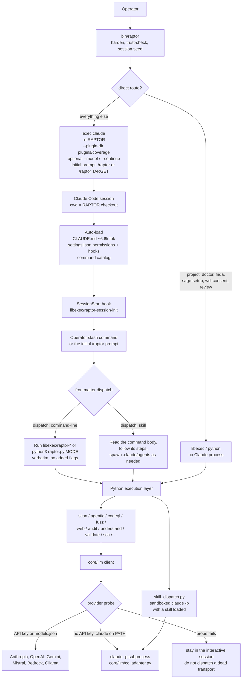
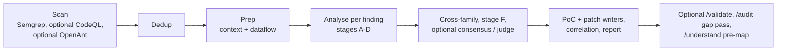

# RAPTOR flow — dissection notes

How this tree actually runs, and every way it invokes Claude Code.
Token figures use the project's own estimator (`len(text) // 4` in
`core/llm/prompt_budget.py`). That over-estimates on purpose. A visual
companion is [flow.html](flow.html).

Upstream at the time of this note: `gadievron/raptor` @ `f820b6e`.
This page describes control flow and prompt *size*. It does not
reproduce prompt bodies.

## Two layers

RAPTOR is not one program that "calls an LLM." It is two layers that
both happen to speak to Claude, through different contracts.

1. **Decision layer** — an interactive Claude Code session. `bin/raptor`
   execs the `claude` CLI. Slash commands, agents, skills, hooks, and
   `CLAUDE.md` live here. This layer decides what to run next.
2. **Execution layer** — Python (`raptor.py`, `libexec/`, `core/`,
   `packages/`). Scanning, dedup, SARIF, sandboxing, cost tracking.
   No judgement. When it needs a model it goes through `core/llm`,
   which *may* shell out to `claude -p` again.

Ollama (and OpenAI, Gemini, Mistral, Bedrock) already exist as
analysis-layer providers. They do not replace the decision layer.
`bin/raptor` exits if `claude` is not on `PATH`, except for a few
direct routes.



## Interactive invocation

`bin/raptor` is the only interactive entry. After PATH scrub, trust
check (`libexec/raptor-cc-trust-check`), and session binding
(`~/.local/share/raptor/sessions.d/`), it does:

```text
exec env -u BASH_ENV -u ENV -u SHELLOPTS -u BASHOPTS \
  claude [--plugin-dir plugins/coverage] [-n RAPTOR] [CLAUDE_ARGS...] [INITIAL_PROMPT]
```

| Piece | What it is |
|---|---|
| `-n RAPTOR` | Session name. Always set. |
| `--plugin-dir plugins/coverage` | Coverage plugin, if that directory exists. |
| `--continue` | From `raptor -c`. Clears the initial prompt. |
| `--model` | From `raptor -m`. Forwarded as a Claude arg. |
| `INITIAL_PROMPT` | `/raptor`, or `/raptor <target>` after control bytes are stripped. Empty on `--continue`. |
| `CLAUDE_CODE_SUBAGENT_MODEL` | Set to `ANTHROPIC_MODEL` when the operator pinned a model and did not set a subagent model. All 18 agents are `model: inherit`. |

Direct execs that never start Claude: `raptor project`, `doctor`,
`frida`, `sage-setup`, `wsl-consent`, `review`.

Claude Code then loads this checkout as the project:

- `CLAUDE.md` (26,590 chars, ~6,647 tokens) is resident for the session.
  It includes the command index, execution rules ("run the dispatch
  verbatim, do not add pipes or flags"), and progressive-loading rules
  for `tiers/`.
- `.claude/settings.json` allow-lists specific `Bash(libexec/raptor-*)`
  patterns, sets `BASH_DEFAULT_TIMEOUT_MS=300000`, and registers
  hooks: `SessionStart` → `raptor-session-init`; `Stop` /
  `SessionEnd` / `PostToolUseFailure` → `raptor-lifecycle-hook`.
- Slash command *bodies* are not all in the boot prompt. Claude Code
  keeps a catalog; the body is read when the command fires
  (`CLAUDE.md` says read `.claude/commands/<name>.md` and obey
  `dispatch:`).
- Agents and skills load on spawn / on demand, not at boot.
- `tiers/` personas load when a workflow asks for them, or when
  Python calls `core/llm/methodology.py` for a non-Claude provider.

The initial `/raptor` prompt is the compatibility command
`.claude/commands/raptor.md` (~862 tokens) whose `dispatch` is
`python3 raptor.py agentic`.

## Headless invocation (`claude -p`)

A second, separate use of the same binary. This is an LLM transport,
not the operator's session. Built in `core/llm/cc_adapter.py`
(`build_cc_command`) and driven by `ClaudeCodeLLMProvider` in
`core/llm/providers.py`.

```text
claude -p
  [--resume SESSION]              # only claudecode-resumable
  --no-session-persistence        # unless persist_session
  --allowed-tools TOOLS
  --max-budget-usd N              # default 5.00 via RAPTOR_CC_BUDGET_USD; adapter default 1.00
  [--model ID]                    # pinned from the probe cache
  [--fallback-model ID]
  [--effort low|medium|high|xhigh|max]
  --exclude-dynamic-system-prompt-sections
  --system-prompt-file PATH       # prompt bytes are NOT put on argv
  [--add-dir PATH]
  --output-format json | stream-json
  [--json-schema JSON]            # stays on argv; no file form
  --strict-mcp-config
  --mcp-config '{"mcpServers": {}}'
```

The user prompt is written to the child's stdin. The system prompt is
staged in a per-process 0700 cache and passed by file, because an
earlier design concatenated system text onto the user message and a
hostile target could re-instruct the model.

Production callers (tests omitted):

| Caller | Role |
|---|---|
| `core/llm/providers.py` `ClaudeCodeLLMProvider` | Analysis-layer transport. Forces `tools=""`. Selected when no other provider is configured and `claude` is on `PATH`. |
| `core/llm/cc_probe.py` | One cheap `claude -p` before committing to that transport. Cached 24h in `~/.raptor/cache/cc-probe.json`. Failure falls back to in-session mode. |
| `core/orchestration/skill_dispatch.py` | Sandboxed `claude -p` with a skill loaded. Used by agentic enrichment passes and the audit validation handoff. Lifecycle bookkeeping via `raptor-run-lifecycle`. |
| `packages/llm_analysis/cc_dispatch.py` | Per-finding analysis dispatch. |
| `core/build/build_detector.py` | Build-system detection via a Claude subprocess. |

Pure-LLM children disable internal tools, pass an empty MCP config,
use a neutral cwd (so the target's `CLAUDE.md`, settings, and hooks
are not loaded), and inherit a sanitised env. User-level Claude
settings still load, because some installs keep backend selection
there.

`claudecode-resumable` is a separate provider id. It reuses one
Claude Code session via `--resume` so later turns avoid re-paying the
prefix. It is never auto-selected.

There is also a local credential-proxy mode
(`RAPTOR_CC_CREDENTIAL_MODE=proxy`): the child gets no provider
credentials and talks to `core/llm/dispatcher` with a minted token.
That dispatcher still fronts Anthropic-shaped APIs. It is not a local
model.

## What a run does after dispatch

`/agentic` (the default initial prompt) is the spine. Other commands
are the same shape with stages skipped.



`/audit` is the other heavy loop: the model forms hypotheses; Semgrep,
Coccinelle, CodeQL, SMT, and Joern produce the verdict. The model is
not supposed to classify code as vulnerable by itself.

Python modes that do not need a model at all (`scan` without
`--analyze`, `doctor`, SCA matching, fuzzing itself) still sit behind
the Claude Code session if you entered through `bin/raptor`.

## Prompt sizes

Nothing below is "the prompt the model always sees." Boot context,
per-command bodies, spawned agents, and per-call analysis bundles are
different stacks. Sums are ceilings, not a single request.

### Always in the interactive session

| Source | Chars | ~Tokens | When |
|---|---:|---:|---|
| `CLAUDE.md` | 26,590 | 6,647 | Every interactive turn |
| Claude Code's own system prompt | not in this repo | ~19,000 cache-read tokens, per `docs/llm.md` | Every `claude` / `claude -p` child, unless a custom system prompt replaces it |
| `.claude/commands/raptor.md` | 3,450 | 862 | Only because the launcher's initial prompt is `/raptor` |
| Command *catalog* | descriptions only | small | Bodies load on use |

`docs/llm.md` records a measured second `claude -p` call reading
~19k cached boot-prompt tokens and dropping cost about 13x. That
prefix is the CLI's default system prompt, not a file in this tree.

### Slash commands — loaded one at a time

39 files, 231,199 chars, ~57,799 tokens if someone stuffed them all
into context. They are not. Largest bodies:

| Command | Chars | ~Tokens | Dispatch |
|---|---:|---:|---|
| `/audit` | 19,481 | 4,870 | skill |
| `/understand` | 18,927 | 4,732 | skill |
| `/validate` | 16,975 | 4,244 | skill |
| `/binary` | 16,185 | 4,046 | `libexec/raptor-binary` |
| `/openant` | 15,042 | 3,760 | `libexec/raptor-openant` |
| `/agentic` | 14,341 | 3,585 | `libexec/raptor-agentic` |
| `/scorecard` | 13,171 | 3,293 | `libexec/raptor-llm-scorecard` |
| `/project` | 10,437 | 2,609 | `libexec/raptor-project-manager` |
| `/cve-diff` | 9,627 | 2,407 | `libexec/raptor-cve-diff` |
| `/exploit` | 7,703 | 1,926 | `python3 raptor.py agentic` |
| `/scan` | 2,786 | 696 | `python3 raptor.py scan` |

A skill-dispatch command then pulls more files. `/validate` points at
`.claude/skills/exploitability-validation/` (the stage files below).
`/audit` points at `.claude/skills/audit/`.

### Agents — one definition per spawn

18 files, 102,107 chars, ~25,526 tokens total. All `model: inherit`.
Largest: `exploitability-validator-agent.md` ~2,895,
`offsec-specialist.md` ~2,298, `crash-analysis-agent.md` ~2,021.
Tool lists are Claude Code tools (`Read`, `Grep`, `Glob`, `Bash`,
`Write`, `Edit`, `Task`, `WebFetch`), not an OpenAI tool schema.

### Skills — on demand, and large

Markdown under `.claude/skills/` (tests and the SecOpsAgentKit
submodule excluded): 34 files, 386,391 chars, ~96,597 tokens. A
workflow reads one skill, not the tree. The biggest single files a
model can be told to read:

| File | ~Tokens |
|---|---:|
| `oss-forensics/github-archive/SKILL.md` | 9,514 |
| `exploitability-validation/stage-e-feasibility.md` | 9,276 |
| `code-understanding/map.md` | 6,185 |
| `exploitability-validation/stage-b-process.md` | 5,661 |
| `exploitability-validation/SKILL.md` | 5,336 |
| `exploitability-validation/stage-d-ruling.md` | 4,106 |
| `exploitability-validation/stage-a-oneshot.md` | 4,012 |
| `audit/SKILL.md` | 4,006 |

The full skills directory including Python, tests, and fixtures is
~204k tokens. That number is a "naive dump" ceiling, not a runtime
prompt.

### Personas and guidance (`tiers/`)

14 files, 79,434 chars, ~19,858 tokens. Loaded one at a time.
`tiers/README.md` says 400–1,000 tokens when active; the files on
disk are larger (personas run ~1,000–2,100 tokens each:
`exploit_developer.md` is 8,526 chars / ~2,131 tokens). Two loaders
must stay in sync: Claude Code progressive loading, and
`load_methodology()` for non-Claude providers.

### Analysis-layer templates — sent through `core/llm`, which may be `claude -p`

These are Python builders, not static blobs. Sizes are the module
that holds the template text. The user turn adds the finding, source
excerpt, and evidence on top.

| Module | Chars | ~Tokens |
|---|---:|---:|
| `packages/cve_env/cve_env/agent/prompts.py` | 81,981 | 20,495 |
| `packages/llm_analysis/prompts/analysis.py` | 45,981 | 11,495 |
| `core/audit/dark_verify/_prompts.py` | 21,045 | 5,261 |
| `packages/llm_analysis/prompts/exploit.py` | 20,864 | 5,216 |
| `packages/checker_synthesis/prompts.py` | 18,979 | 4,745 |
| `packages/sca/llm/prompts.py` | 14,724 | 3,681 |
| `packages/cve_diff/cve_diff/agent/prompt.py` | 13,907 | 3,477 |
| `packages/llm_analysis/prompts/patch.py` | 11,177 | 2,794 |
| `packages/llm_analysis/prompts/schemas.py` | 10,112 | 2,528 |
| `core/audit/differential/_prompts.py` | 7,698 | 1,924 |
| `packages/code_understanding/prompts/` (3 files) | 7,001 | 1,750 |

### Budgets the code already assumes

| Site | Budget |
|---|---|
| `prompt_budget.py` documented example | 60,000 tokens, then shed low-priority sections |
| Priority-0 elision floor | 512 tokens — source/evidence is never cut below this |
| `claude -p` per-call abort | 5.00 USD default (`RAPTOR_CC_BUDGET_USD`); adapter field default 1.00 |
| Agentic run cap | 10 USD (`--max-cost-usd`) |
| Provider timeout | 600s default; checker synthesis 1,800s |
| Bash tool timeout | 300,000 ms (`settings.json`) |
| `claude -p` worker cap | 4 (`RAPTOR_CC_MAX_WORKERS`), so parallel first calls do not race the server prompt cache |
| CVE-diff agent loop | `budget_tokens` default 400,000; one call site passes 600,000 |

A typical *interactive* turn is roughly: Claude's own ~19k system
prefix + `CLAUDE.md` ~6.6k + one command body (often 3–5k) + one
skill file (often 4–9k) + tool schemas. A typical *analysis* call is
the template module above plus a finding bundle, fitted toward a
60k-token budget. Those are different prompts. Neither is small.

## What is not a Claude call

Worth listing so a later port does not "replace" them with a model:

- Semgrep, CodeQL, Coccinelle, AFL++, Joern, SMT solvers, Ghidra,
  radare2, Frida, `rr`. These are the verdict path for `/audit`.
- `libexec/raptor-llm-ask` can target any configured provider,
  including a non-Claude one. It is a developer probe, not the
  orchestrator.
- The coverage plugin, session ledger, and lifecycle hooks are
  process bookkeeping. They assume a Claude Code hook API.

## Constraints added after the first pass

These are portability constraints, not more call sites. They change
how the issues above should be read.

### Claude Code as the base shrinks the server menu

The analysis path already speaks OpenAI-compatible HTTP
(`OpenAICompatibleProvider`: Ollama, vLLM, LM Studio, via `base_url`).
The decision layer does not. `bin/raptor` execs the `claude` binary.
That binary talks Anthropic Messages, plus CLI flags that never become
an HTTP call (`--json-schema`, `--resume`, `--effort`, hooks, plugins).

A listed Anthropic route is not "Claude Code works":

- llama.cpp's server README currently lists Anthropic Messages API
  compatible chat completions. That is a route. It is also the server
  with the hardware knobs (GPU layers, tensor split, KV cache dtype,
  `--fit` shrinking context to VRAM). Those knobs are why it is the
  one you want on odd hardware, and why a thin compatibility layer is
  not the same product.
- Ollama documents a Claude Code setup (`ANTHROPIC_BASE_URL`,
  `ollama launch claude`). Its own compatibility page says it does
  not implement prompt caching, forced `tool_choice`, or
  `count_tokens`. Extended-thinking `budget_tokens` is accepted and
  not enforced. Fewer knobs than llama.cpp. RAPTOR's own Ollama path
  is the OpenAI `/v1` shim, not this Anthropic one.
- vLLM is the OpenAI-compatible server RAPTOR already names. An
  Anthropic-compatible front has been a moving target; treat "it
  worked on this box" as a per-hardware fact.

Hardware variation sits on top of the protocol gap: CUDA, ROCm,
Metal, Vulkan, CPU, GGUF versus AWQ/FP8, flash-attn or not. A matrix
of "which server, which GPU, which flag Claude Code sent" will not
be one config.

### Smaller context is the win condition

`core/llm/config.py` already assumes this split: frontier context
default 1,000,000 tokens, local default 32,000, local output default
4,096. That 32k figure is one failure mode, not the taxonomy.

Windows are small for different reasons, and they fail differently:

- trained context and RoPE base
- KV cache bytes, linear in context, layers, and KV heads
- KV cache quant (q8/q4) buying window by spending quality
- sliding-window or hybrid architectures
- prefill time collapsing before VRAM does
- a server `--fit` pass shrinking context so the model loads at all
  (llama.cpp's fit floor is a few thousand tokens)

Squeezing the resident prompt (CLAUDE.md, command body, skill file,
analysis template) raises the fraction of those setups that can run
the same workflow. A 60k fit budget and a 400k CVE-diff loop are not
portable targets. They are frontier targets.

### Own hardware and rented GPUs are not one "local"

`docs/llm.md` puts both in a single "Local (Ollama)" column and marks
the cost "Free". That column is wrong for a rented GPU box, and it
is wrong for a 24 GB workstation.

- Own machine: one or a few GPUs, VRAM is a hard cap, quant is
  mandatory, context is the first thing sacrificed, airgap is
  possible.
- Rented GPUs: still your weights, not Claude, but the box can be
  eight large GPUs, long context, higher precision. The limit is
  rental cost, quota, and cold start — not the laptop's VRAM.
  Prefix cache and tensor parallel are available. Do not size the
  port for this and then claim it runs at home.

Issue #6 mixed these. Keep them apart when picking worker caps,
context budgets, and what "works locally" means.
